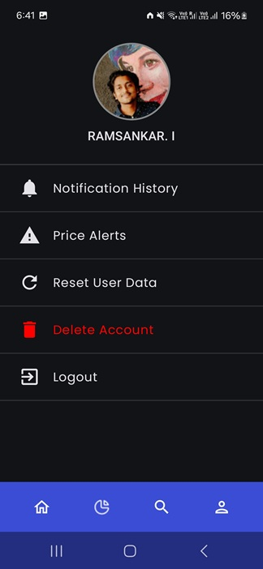

# StockVision
A modern Android app designed for stock enthusiasts. Seamlessly track real-time stock prices, set customizable alerts, and predict future prices with cutting-edge ML technology!

## Features
- Firebase Authentication - Provides secure login with Google Sign-On for a personalized experience
- WorkManager Alerts - Delivers push notifications to keep users updated on price changes
- TFLite LSTM Price Prediction - Leverages machine learning for accurate future price forecasting
- Dynamic Watchlist with RoomDB - Offers customizable stock lists with offline storage capabilities
- Stock Graph with Canvas - Features interactive price visualization for intuitive analysis
- Offline Caching Support - Ensures data access even without an internet connection

## Screenshots

---
## Tech Stack
#### Android
- Jetpack Compose - Modern UI framework for a sleek, responsive interface
- RoomDB - Robust offline database for persistent data storage
- Coroutines - Efficient asynchronous programming for smooth performance
#### Architecture
- MVVM Architecture - Structured design pattern for scalable code organization
#### Backend
- Firebase Auth - Secure user authentication with Google Sign-On integration
#### ML
- TFLite (LSTM) - Advanced machine learning framework for price predictions
#### Utilities
- WorkManager - Manages background tasks like push notifications
- Coil - High-performance image loading library
- Hilt - Dependency injection framework for clean and testable code